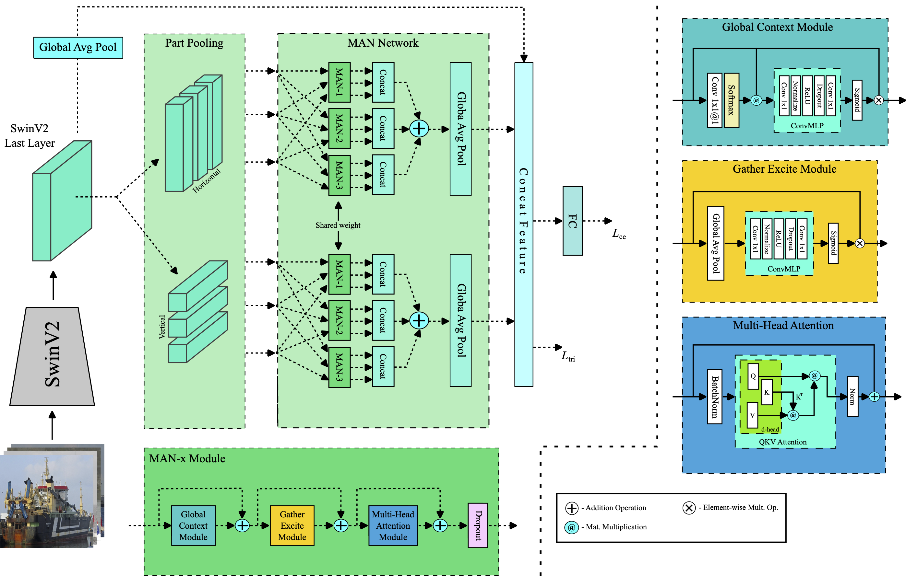

# Part pooling with mixture of attention networks for image-based vessel reidentification

Reza Fuad Rachmadi, Anggit Wikanningrum, Khusnul Muchlisin, I Ketut Eddy Purnama

## Abstract

In vessel traffic management systems, an Automatic Identification System (AIS) is usually used to track vessel positions and control 
the flow. One disadvantage of AIS is that the ship's crew can deactivate the transceiver installed on the ship. To support the AIS, 
other systems need to be implemented, including image-based vessel reidentification systems. In this paper, we propose a part pooling 
with a mixture of attention networks (PP-MAN) model for image-based vessel reidentification problems. The proposed model is formed by 
attaching mixtures of attention networks to a Swin Transformer V2 backbone with a part-pooling mechanism. Three different attention 
mechanisms were used to form the MAN module, including Multi-Head Attention, Gather Excite, and Global Context. To test the performance 
of our proposed model, we used three reidentification datasets, including Warship, VesselReID-1248, and ShipReID-2400. Experiments on 
those three datasets show that our proposed model achieves state-of-the-art performance across all datasets, with an mAP of 89.1% and 
rank-1 of 97.2% on the Warship dataset, an mAP of 61.3% and rank-1 of 72.3% on the VesselReID-1248 dataset, and an mAP of 42.7% and 
rank-1 of 50.3% on the ShipReID-2400 dataset. Further GradCAM and t-SNE analysis show that our proposed model extracted features from 
some vessel parts and can distinguish between vessel IDs.

## Model Architecture

